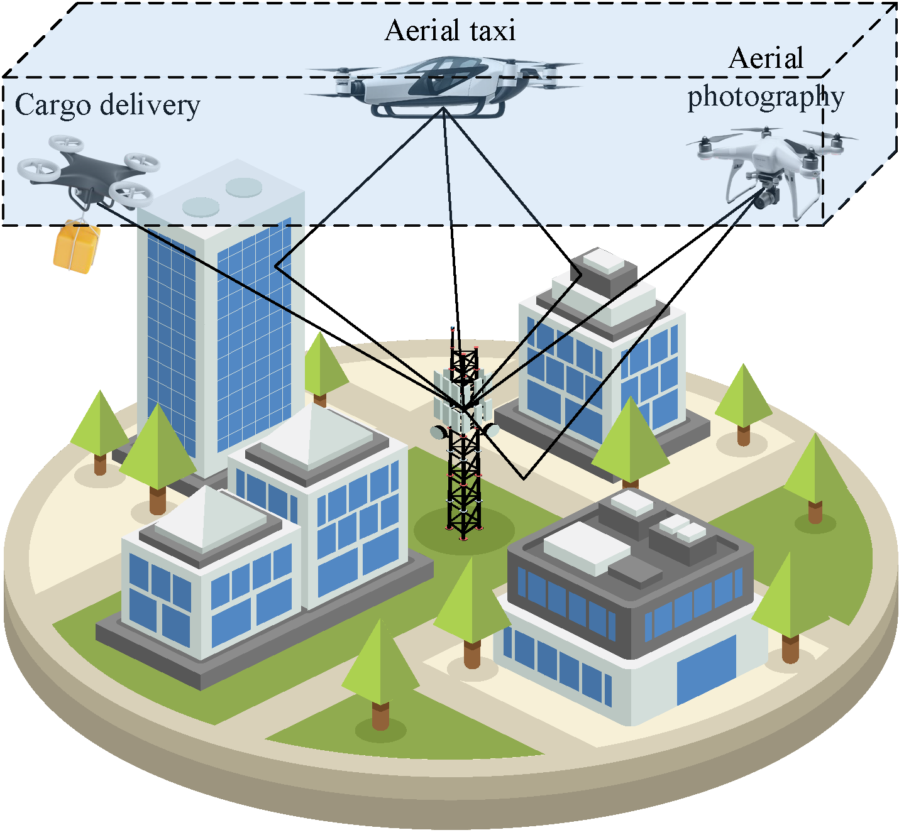

# 🚨 LAE


The scenario of low-altitude economy.  

## 📝 Information:
This is the source code for paper  
__"Radio Map-Assisted Channel Estimation for Low-Altitude Economy"__  
_Welcome to cite this article !_

```bibtex
@article{yang2025radio,
  title={Radio map-assisted channel estimation for low-altitude economy},
  author={Yang, Bin and Wang, Wei and Zhang, Wei},
  journal={IEEE Trans. wireless commun.},
  volume={ },
  number={ },
  pages={ },
  month={ },
  year={2025},
  publisher={IEEE}
}
```
Video introducing radio map: https://www.youtube.com/watch?v=KqihgPd0c2o

## 🛠️ Please follow the following steps:
__1. Configure virtual environment for this repository__  
```python
# Create virtual environment for this repository (pip install virtualenv)  
virtualenv env_LAE

# Activate the created environment
source env_LAE/bin/activate
```

__2. Download the repository to local__
```python
# git clone the repository to your folder
git clone https://github.com/yangbin-xd/LAE.git  

# cd to the folder
cd LAE
```

__3. Install the required modules__
```python
# pip install required modules according to the requirements
pip install -r requirements.txt --no-deps

#  Please uninstall the numpy with high version
pip uninstall numpy

# And degrade the numpy version to 1.19.5
pip install numpy==1.19.5
```

__4. Then, you can run files__
```python
# preprocess .mat file to .py file   
python preprocess.py

# benchmark of CGAN
python cgan.py

# benchmark of DNN+LSTM  
python dnn.py & python lstm.py

# The proposed cvcgan
python estimator.py & python gan.py

# The integration of radio map and pilots, as well as baseline of LS, benchmark of ChnanelNet
python cnn.py
```

## 👤 Authors:  
authors: Bin Yang∗, Wei Wang†, Wei Zhang∗  
∗University of New South Wales, Sydney, NSW 2052, Australia   
†Peng Cheng Laboratory, Shenzhen 518055, China  
Email: bin.yang@unsw.edu.au, wangw01@pcl.ac.cn, w.zhang@unsw.edu.au  

## 📨 Contact:  
If you have any questions about this code, you are welcome to contact me via:  
binyang_2020@163.com  

## 🗂️ Introduction:  
data is the dataset generated by MATLAB                
model is to save the deep learning model  
result is to save the generated pictures and NMSE results  
loss is to save training and validation loss
preprocess.py is to transfer the mat file to npy file  
process.py is to process CSI and label
cgan.py is the benchmark of CGAN
dnn.py & lstm.py is the benchmark of DNN + LSTM  
cnn.py contains LS, ChannelNet and radio map  
fig1.py is the code to plot Fig. x in the paper  
fig2.py is the code to plot Fig. 12 in the paper  
fig3.py is the code to plot Fig. 13 in the paper  
fig4.py is the code to plot Fig. x in the paper  
fig5.py is the code to plot Fig. 14 in the paper  
fig6.py is the code to plot Fig. 15 in the paper    

## 🚀 Environment:  
numpy                   1.19.5  
matplotlib              3.6.3  
keras                   2.6.0  
tensorflow-gpu          2.6.0  
__Details please see requirements.txt__
