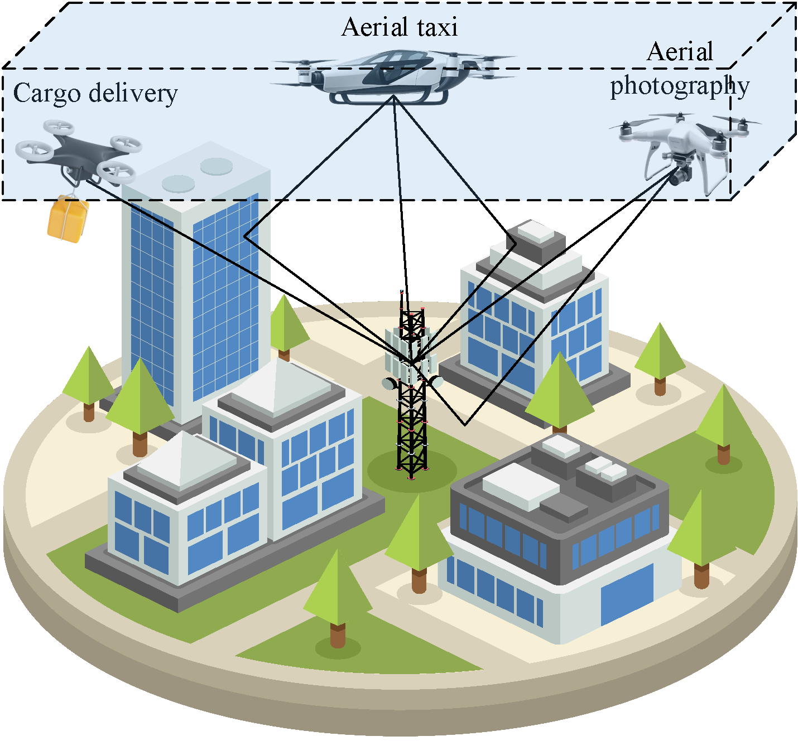

# 🚨 Low-Altitude Economy

[](https://github.com/yangbin-xd/LAE)
[](https://ieeexplore.ieee.org/abstract/document/11397522)
[](https://opensource.org/licenses/MIT)


The scenario of low-altitude economy.  

## 📝 Information:
This is the source code for paper  
__"Generative Radio Map-Assisted Channel Estimation in Low-Altitude Economy"__  

https://ieeexplore.ieee.org/abstract/document/11397522  
_Welcome to cite this article !_

```bibtex
@article{yang2026generative,
  title={Generative radio map-assisted channel estimation in low-altitude economy},
  author={Yang, Bin and Wang, Wei and Zhang, Weizheng and Zhang, Wei},
  journal={IEEE Trans. Mobile Comput.}
  year={early access},
  publisher={IEEE}
}
```

Video introducing dataset software: https://github.com/yangbin-xd/ray-tracing/blob/main/README.md  
Video introducing radio map: https://www.youtube.com/watch?v=KqihgPd0c2o

## 🛠️ Please follow the following steps:
__1. Configure virtual environment for this repository__  
```python
# Create virtual environment for this repository (python3.8)  
python3 -m venv env_LAE  

# Activate the created environment
source env_LAE/bin/activate
```

__2. Download the repository to local__
```python
# git clone the repository to your folder
git clone https://github.com/yangbin-xd/LAE.git  

# cd to the folder
cd LAE

# create model folder  
mkdir -p model

# download trained models if you do not want to train them by yourself
# the trained models are in the release and can be downloaded to model folder or use curl  
curl -s https://api.github.com/repos/yangbin-xd/LAE/releases/latest | grep -oE 'https://[^"]+\.h5' | while read -r url; do curl -L -o "model/$(basename "$url")" "$url"; done  
```

__3. Install the required modules__
```python
# pip install required modules according to the requirements
pip install -r requirements.txt --no-deps

#  Please uninstall the numpy with high version
pip uninstall numpy

# And degrade the numpy version to 1.19.5
pip install numpy==1.19.5
```

__4. Then, you can run files__
```python
# preprocess .mat file to .py file   
python preprocess.py

# benchmark of CGAN
python cgan.py

# benchmark of UNet
python unet.py

# benchmark of DNN+LSTM  
python dnn.py & python lstm.py

# The proposed cvcgan
python estimator.py & python gan.py

# The integration of radio map and pilots, as well as baseline of LS, benchmark of ChnanelNet
python cnn.py
```

## 👤 Authors:  
authors: Bin Yang∗, Wei Wang†, Weizheng Zhang†, Wei Zhang∗  
∗University of New South Wales, Sydney, NSW 2052, Australia   
†Harbin Institute of Technology (Shenzhen), Shenzhen 518055, China  

## 📨 Contact:  
If you have any questions about this code, you are welcome to contact me via:  
binyang_2020@163.com  

## 🗂️ Introduction:  
model is provided in the releases, follow instructions to download    
data is the dataset generated by MATLAB                
result is to save the generated pictures and NMSE results  
loss is to save training and validation loss  
preprocess.py is to transfer the mat file to npy file  
process.py is to process CSI and label  
cgan.py is the benchmark of CGAN  
unet.py is the benchmark of UNet  
dnn.py & lstm.py is the benchmark of DNN + LSTM  
cnn.py contains LS, ChannelNet and radio map  
ablation.py is the ablation study  
sample.py is the trajectory generalization   
fig1.py is the code to plot Fig. 9 in the paper  
fig2.py is the code to plot Fig. x in the paper  
fig3.py is the code to plot Fig. 10 in the paper  
fig4.py is the code to plot Fig. 11 in the paper  
fig5.py is the code to plot Fig. 12 in the paper  
fig6.py is the code to plot Fig. 13 in the paper    

## 🚀 Environment:  
numpy                   1.19.5  
matplotlib              3.6.3  
keras                   2.6.0  
tensorflow-gpu          2.6.0  
__Details please see requirements.txt__
